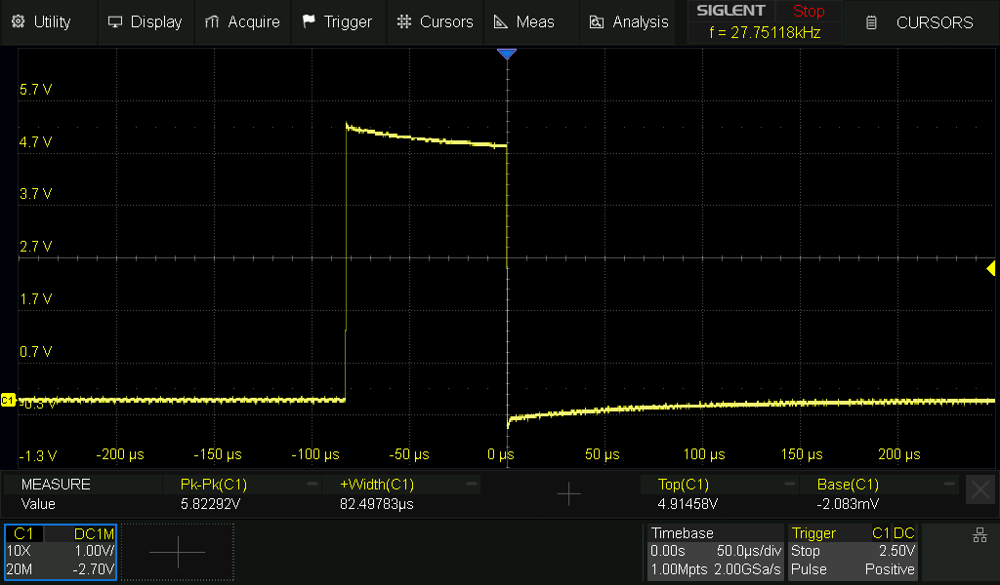
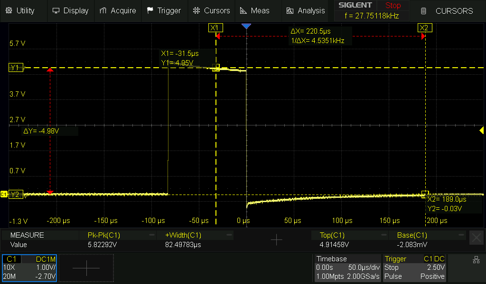

# v1.3 Fault Recovery and Watchdog — Validation Record

## Milestone

```text
v1.3-fault-recovery-and-watchdog
```

Development branch:

```text
feature/fault-recovery-watchdog
```

Implementation head before the final documentation commit:

```text
278f6f5 — test: add watchdog hardware validation build
```

Physical-validation dates:

```text
2026-08-10 to 2026-08-11
```

## Purpose

This milestone adds an explicit fault policy, bounded cooperative HX711
recovery and hardware-watchdog supervision to the non-blocking `v1.2`
application.

The validation must prove more than native state-machine logic. It must also
show on the real Nano that:

- a disconnected `DOUT` is detected deterministically;
- recovery uses a bounded number of real HX711 power cycles;
- recovery never exposes an untrusted level indication;
- interrupted tare and calibration operations do not commit partial results;
- inputs rejected during recovery cannot execute later;
- a stalled main execution path causes a hardware reset;
- persistent configuration and normal measurement survive the recovery paths.

---

## Implemented fault contract

| Code | Meaning | Policy |
|---:|---|---|
| `01` | HX711 initialization failure | Terminal |
| `02` | HX711 startup readiness timeout | Recover sensor |
| `03` | HX711 runtime conversion timeout | Recover sensor |
| `04` | HX711 read failure | Recover sensor |
| `05` | Multi-sample collection timeout | Recover sensor |
| `06` | Invalid sample-collector state | Terminal |
| `07` | Invalid active calibration | Terminal |
| `08` | Internal application-state inconsistency | Terminal |
| `09` | Persistent-storage access failure | Terminal |

Recoverable faults use:

```text
500 ms backoff
2000 ms ready deadline per attempt
3 attempts maximum
```

During recovery, normal level indication is disabled and the LOW and HIGH LEDs
alternate every 250 ms. A terminal fault latches the HIGH blinking pattern and
requires reset.

---

## Native regression

Official project runner:

```powershell
powershell `
    -ExecutionPolicy Bypass `
    -File .\scripts\run-native-tests.ps1
```

Validated inventory:

| Environment | Tests |
|---|---:|
| `native_button` | 11 |
| `native_hx711` | 18 |
| `native_level_indicator` | 14 |
| `native_operation_indicator` | 18 |
| `native_scale` | 35 |
| `native_app_fault` | 5 |
| `native_app` | 70 |
| `native_tare_record` | 20 |
| `native_tare_storage` | 21 |
| `native_calibration_storage` | 40 |
| `native_console` | 43 |
| `native_time_delay` | 6 |
| `native_watchdog_validation` | 6 |
| **Total** | **307** |

Final result:

```text
Suites:   13/13
Tests:    307/307
Failures: 0
Result:   PASS
```

An independent host rebuild and execution of all suites also passed with:

```text
GCC/G++ 13.3.0
-Wall -Wextra -Werror -pedantic
```

---

## AVR build and memory validation

Final build environments:

```text
nanoatmega328new
nanoatmega328new_arduino
nanoatmega328new_watchdog_validation
nanoatmega328new_arduino_watchdog_validation
```

| Environment | Static SRAM | Flash | Result |
|---|---:|---:|---|
| Direct AVR production | `230 / 2048 B` (`11.2%`) | `17738 / 30720 B` (`57.7%`) | PASS |
| Arduino reference | `239 / 2048 B` (`11.7%`) | `18032 / 30720 B` (`58.7%`) | PASS |
| Direct AVR watchdog validation | `231 / 2048 B` (`11.3%`) | `18076 / 30720 B` (`58.8%`) | PASS |
| Arduino watchdog validation | `240 / 2048 B` (`11.7%`) | `18370 / 30720 B` (`59.8%`) | PASS |

The production change from `v1.2` is:

```text
Direct AVR:       +13 SRAM bytes, +840 Flash bytes
Arduino reference: +13 SRAM bytes, +838 Flash bytes
```

No heap allocation was introduced.

---

## Physical setup

- Arduino Nano with ATmega328P at 16 MHz.
- Real HX711 and load cell.
- D4 tare/cancel and D8 calibration/confirm buttons.
- LOW, MEDIUM and HIGH indicator LEDs.
- 115200-baud serial monitor with timestamps.
- Configured `1500 g` reference mass.
- External `10 kΩ` pull-up between Nano D2 and the shared 5 V logic rail.

The pull-up remained on the Nano side of the removable `DOUT` connection. A
disconnected conductor therefore held D2 HIGH, the HX711 protocol's
not-ready state, instead of leaving the input floating.

An earlier floating-input experiment was rejected as a validation method after
it produced implausible readings such as `4763.94 g`, `-986.15 g`,
`-6736.27 g` and `7639.00 g`.

---

## Physical watchdog validation

The deliberate-stall hook was tested in both dedicated validation
environments. D4 and D8 were first released to arm the one-shot trigger and
were then pressed together after normal measurement had started.

| Environment | Stall diagnostic | Next startup | Interval | Visible cause |
|---|---|---|---:|---|
| Direct AVR | `19:47:11.532` | `19:47:13.787` | `2.255 s` | `unknown` |
| Arduino reference, run 1 | `19:53:06.955` | `19:53:09.215` | `2.260 s` | `unknown` |
| Arduino reference, run 2 | `19:53:21.017` | `19:53:23.277` | `2.260 s` | `unknown` |

All runs restarted safely, restored tare offset `-217186`, retained the
`45.589332 counts/g` calibration factor and resumed measurements near `930 g`
with level `MEDIUM`.

Keeping both buttons pressed through reset did not retrigger the deliberate
stall. The Nano bootloader path did not preserve a supported `MCUSR` flag for
the application, so `unknown` is the validated and documented diagnostic for
this hardware and bootloader combination.

Result:

```text
PASS
```

---

## HX711 PD_SCK electrical validation

The production direct-AVR recovery pulse was captured with a Siglent
oscilloscope using a x10 probe, 20 MHz bandwidth limit, 50 us/div timebase and
a positive-pulse trigger at 2.5 V.



| Measurement | Result |
|---|---:|
| Automatic positive width | `82.49783 us` |
| Required power-down width | `>60 us` |
| Stable HIGH level | `4.91458 V` |
| Stable LOW level | `-2.083 mV` |

The manual cursor capture independently places HIGH near `4.95 V` and LOW near
`-0.03 V`:



`Pk-Pk = 5.82292 V` includes edge overshoot and undershoot and is therefore not
used as the stable logic-level measurement.

Result:

```text
PASS
```

---

## Automatic recovery and retry exhaustion

With a stable baseline near `924-930 g`, `DOUT` was disconnected while the
external pull-up held D2 HIGH.

### Recovery after reconnection

| Event | Timestamp | Result |
|---|---|---|
| Runtime timeout | `20:15:25.602` | `FAULT 03`; normal level disabled |
| Attempt 1 power cycle | `20:15:26.102` | No ready conversion before deadline |
| Attempt 2 power cycle | `20:15:28.617` | Connection restored |
| Recovery succeeded | `20:15:29.075` | Previous configuration retained |
| First recovered weight | `20:15:29.083` | `924.08 g`, `MEDIUM` |
| Next valid weight | `20:15:29.586` | `925.83 g`, `MEDIUM` |

### Exact retry exhaustion

A second disconnection was left present:

| Event | Timestamp |
|---|---|
| Runtime timeout | `20:15:31.250` |
| Attempt 1 power cycle | `20:15:31.758` |
| Attempt 1 timeout | `20:15:33.763` |
| Attempt 2 power cycle | `20:15:34.259` |
| Attempt 2 timeout | `20:15:36.271` |
| Attempt 3 power cycle | `20:15:36.769` |
| Terminal fault | `20:15:38.775` |

The LOW/HIGH recovery pattern changed to persistent HIGH blinking after the
third timeout. Reconnecting `DOUT` alone did not leave the terminal state; a
reset was required as designed.

Result:

```text
PASS
```

---

## Interrupted transactional operations

### Operational tare sampling

The valid pre-test tare was `-175517`. A `1500 g` load was intentionally left
on the platform while tare sampling was started, and `DOUT` was disconnected
before the 20-sample candidate completed.

| Check | Result |
|---|---|
| Fault | `FAULT 05: HX711 sample collection timeout` |
| Recovery | Attempt 1 |
| Partial offset applied or saved | No |
| Pre-fault loaded mean | `1525.95 g` |
| First recovered mean | `1521.98 g` |
| Difference | `-3.97 g` (`-0.26%`) |
| Empty platform after unloading | Approximately `-5 g` |
| Tare loaded after reset | `-175517` |

If the interrupted tare had been committed, the loaded platform would have
read near zero. Returning near `1.52 kg` and later near zero independently
proves that the previous offset remained active and persistent.

Result: **PASS**.

### Calibration-zero sampling

The valid pre-test tare was `-176304`. The `1500 g` load remained in place
while the calibration-zero collector was interrupted.

| Check | Result |
|---|---|
| Fault | `FAULT 05` |
| Recovery | Attempt 1 |
| Partial calibration tare saved | No |
| Weight before fault | Approximately `1504.35 g` |
| Mean of all 17 recovered loaded readings before unloading | `1495.83 g` |
| Empty platform after unloading | Near `0 g` |
| Factor loaded after reset | `45.589332 counts/g` |
| Tare loaded after reset | `-176304` |

Result: **PASS**.

### Calibration reference-mass sampling

The zero phase first completed normally and committed tare `-176317`. The
reference-mass collector was then interrupted with `1500 g` in place.

| Check | Result |
|---|---|
| Fault | `FAULT 05` |
| Recovery | Attempt 2 |
| Partial factor calculated, applied or saved | No |
| First recovered loaded mean | `1548.71 g` |
| Empty-platform mean after unloading | `-2.29 g` |
| Stored calibration after reset | Absent |
| Active factor after reset | Default `45.589332 counts/g` |
| Tare loaded after reset | `-176317` |

The committed zero is intentionally retained because its save boundary had
already completed. The incomplete factor is intentionally discarded.

Result: **PASS**.

---

## Inputs across recovery boundaries

### Physical buttons

D4 and D8 were held across physical recovery boundaries, including consecutive
recoveries that succeeded on attempts 2 and 3. The debouncers continued to be
updated, but neither button started a delayed tare or calibration while held or
when later released.

Result: **PASS**.

### UART commands

`ctq` was sent during recovery. The serial output reported two immediate
responses during each of the first two attempts:

```text
Recovery in progress.
Recovery in progress.
Recovery in progress.
Recovery in progress.
```

during both the first and second recovery attempts. Recovery succeeded on
attempt 2, normal measurements resumed near `14-15 g`, and no tare,
calibration or cancellation action executed later.

Result: **PASS**.

The complete physical matrix exercised at least 16 automatic HX711 power-cycle
attempts:

| Scenario | Power-cycle attempts |
|---|---:|
| Ordinary reconnection plus retry exhaustion | 5 |
| Interrupted operational tare | 1 |
| Interrupted calibration zero | 1 |
| Interrupted calibration mass | 2 |
| Two consecutive button-boundary recoveries | 5 |
| UART-discard recovery | 2 |
| **Minimum total** | **16** |

Every successful recovery resumed real conversions; no test exposed normal
level indication before recovery succeeded.

The startup-not-ready hardware condition had already been injected in the
`v1.2` physical validation. For `v1.3`, native application tests prove that
`FAULT 02` enters the same bounded recovery FSM exercised here through
`FAULT 03` and `FAULT 05`. No separate `FAULT 02` serial capture was retained
for this release; the entrance transition and the real recovery hardware path
are validated by those complementary layers.

---

## Final normal-operation regression

After the fault tests:

1. serial `t` completed and saved a new tare offset of `-175467`;
2. the first five measurements after tare averaged approximately `0.66 g`;
3. serial `c` started calibration normally;
4. serial `q` cancelled it without changing the active factor;
5. reset reloaded tare `-175467` and factor `45.589332 counts/g`;
6. the first five post-reset measurements averaged approximately `-1.45 g`.

This proves that recovery does not permanently disable normal input,
persistence, calibration control, measurement or level indication.

Result:

```text
PASS
```

---

## Final acceptance

| Requirement | Status |
|---|---|
| Explicit stable fault codes and policies | PASS |
| Cooperative bounded recovery | PASS |
| Normal output disabled during recovery | PASS |
| Exact three-attempt terminal transition | PASS |
| External DOUT pull-up and deterministic disconnect detection | PASS |
| Real PD_SCK power-down timing and levels | PASS |
| More than ten real automatic power-cycle attempts | PASS |
| Interrupted tare preserves active and stored offset | PASS |
| Interrupted calibration zero preserves previous tare | PASS |
| Interrupted mass phase preserves previous factor | PASS |
| D4/D8 suppression across recovery | PASS |
| UART discard without replay | PASS |
| Hardware watchdog reset in both entry-point environments | PASS |
| Safe restart and persistent-state restoration | PASS |
| Native regression: 13 suites / 307 tests | PASS |
| Four AVR environments fit SRAM and Flash | PASS |
| Final normal-operation regression | PASS |

All functional, native, build and physical requirements for the milestone
passed. The final documentation commit, merge into `main` and annotated tag are
repository-closing operations and do not require further fault injection.
